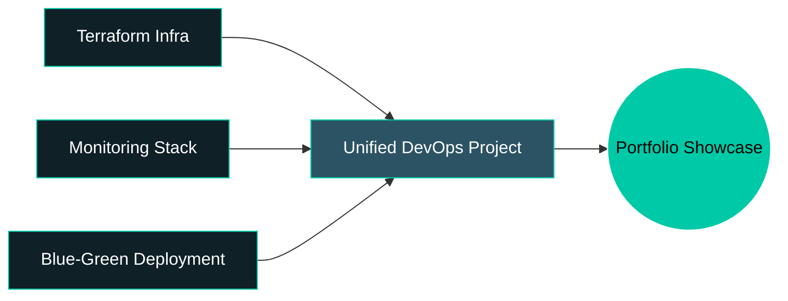

<div align="center">

<!-- ================= HEADER BANNER ================= -->


<!-- ================= TYPING INTRO ================= -->
<a href="https://git.io/typing-svg">
  
</a>

<br/>

<!-- ================= SOCIAL BADGES ================= -->
<a href="https://www.linkedin.com/in/PUT-YOUR-LINKEDIN-HANDLE-HERE/"></a>
<a href="mailto:your.email@placeholder.com"></a>
<a href="https://your-portfolio-url-placeholder.dev"></a>
<a href="https://github.com/DeveloperKSD"></a>

</div>

<br/>

<!-- ================= FAKE TERMINAL ABOUT ME ================= -->
<table align="center">
<tr><td>

```bash
kshitij@devops-lab:~$ whoami --verbose

> Name        : Kshitij Dhalwani
> Role        : 3rd Year B.Tech (Integrated CS), NMIMS MPSTME
> Currently   : Interning @ Shivaami — building GCP infrastructure
> Focus       : DevOps · Cloud · SRE
> Status      : [ONLINE] shipping infra at unreasonable hours
> Side Quests : Hackathons | AI/ML research paper | Building "Valoria" (C++ RPG)

kshitij@devops-lab:~$ cat mission_statement.txt

> I like systems that don't fall over.
> If it can autoscale, self-heal, or alert me before it breaks —
> I probably already built a dashboard for it.

kshitij@devops-lab:~$ _
```

</td></tr>
</table>

<br/>

<!-- ================= WHAT I DO ================= -->
<h2 align="center">⚙️ What I Actually Do</h2>

<table align="center" width="100%">
<tr>
<td width="50%" valign="top">

### ☁️ Infra & Cloud
- Designed a **Terraform-based autoscaling architecture** on GCP — MIG + Global HTTP Load Balancer + custom autoscaler
- Built a **Flask monitoring dashboard** to visualize the whole stack live
- Deployed a **Prometheus + Grafana** observability stack across multiple GCP VMs
- Comfortable debugging infra at 2 AM when the autoscaler decides to misbehave

</td>
<td width="50%" valign="top">

### 🧪 Building & Breaking
- Active **hackathon competitor** — multiple completed, more incoming
- Co-authoring an **AI/ML technical paper** with faculty
- Built an **ATS Resume Scanner** (Streamlit + Groq/Llama 3.3-70B + Docker)
- Wrote **Valoria**, a C++ RPG, because not everything needs a YAML file

</td>
</tr>
</table>

<br/>

<!-- ================= TECH STACK ================= -->
<h2 align="center">🧰 Tech Arsenal</h2>

<div align="center">

**Cloud & Infra**
<br/>


<br/><br/>

**Languages & Frameworks**
<br/>


<br/><br/>

**Data & Tools**
<br/>


</div>

<br/>

<!-- ================= GITHUB STATS ================= -->
<h2 align="center">📊 The Numbers</h2>

<div align="center">


</div>

<div align="center">

</div>

<div align="center">

</div>

<!-- ================= WAKATIME ================= -->
<h3 align="center">⏱️ Weekly Coding Breakdown (WakaTime)</h3>
<p align="center"><sub>Activate by linking your WakaTime API key — see setup note below</sub></p>
<div align="center">

<!--START_SECTION:waka-->
```text
From Mon - Sun  19 Jul 2026 - 25 Jul 2026

🚧 No WakaTime data yet — connect your account to light this up.
```
<!--END_SECTION:waka-->

</div>

<br/>

<!-- ================= CONTRIBUTION SNAKE ================= -->
<h2 align="center">🐍 The Contribution Snake</h2>
<div align="center">
  
  <p><sub>(renders once the Action below runs for the first time — see setup section)</sub></p>
</div>

<br/>

<!-- ================= FEATURED PROJECTS ================= -->
<h2 align="center">🚀 Featured Builds</h2>

<table align="center" width="100%">
<tr>
<td width="50%">

#### ☁️ GCP Autoscaling Architecture
**Terraform · MIG · Load Balancer · Flask**
<br/>
Self-healing, auto-scaling infrastructure on GCP — provisioned entirely via Terraform, with a custom Flask dashboard for live monitoring.
<br/><br/>


</td>
<td width="50%">

#### 📈 Monitoring Stack (Prometheus + Grafana)
**Observability · GCP VMs**
<br/>
Full metrics pipeline across multiple GCP VMs, turning raw system signals into dashboards that actually tell you something useful.
<br/><br/>


</td>
</tr>
<tr>
<td width="50%">

#### 🧠 ATS Resume Scanner
**Streamlit · Docker · Groq (Llama 3.3-70B)**
<br/>
Dual-mode resume analyzer for recruiters and applicants, with LLM-powered scoring and matplotlib visual breakdowns.
<br/><br/>


</td>
<td width="50%">

#### ⚔️ Valoria
**C++ · OOP · Game Logic**
<br/>
A from-scratch RPG built in C++ — because sometimes you want to fight dragons instead of fixing YAML indentation.
<br/><br/>


</td>
</tr>
</table>

<br/>

<!-- ================= CURRENTLY / NEXT UP ================= -->
<h2 align="center">🗺️ Currently Building</h2>

<div align="center">



</div>

<br/>

<!-- ================= QUOTE / FOOTER ================= -->
<div align="center">

> *"It works on my machine" is not a deployment strategy — but a working CI/CD pipeline is.*

<br/>


<br/><br/>


</div>
